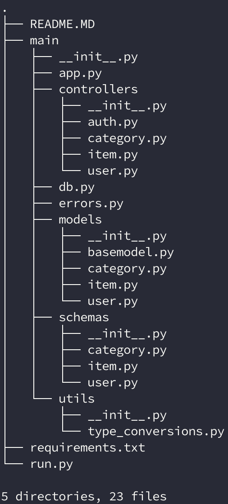

# Onboard Project Server side
## Description:
This is a Python Flask Application. It serves multiple endpoints allowing user to manipulate categorized items.

## Prerequisites:
- Python 3.7
- MySQL

## How to install:
You should create a virtual environment so that it will not affect other projects.
``` 
Create virtual env: 
virtualenv venv --python=python3
Install pip modules:
pip install -r requirements.txt
```
## How to run:
``` 
python run.py
```

## Project Overview:
### Endpoints:
You can see endpoints and its request/response example here:
[API documentation](https://documenter.getpostman.com/view/6660523/SVtVVoQ3?version=latest)

### Entity relationship:


### Project folder structure:

In each resource in modules, it usually has:
- **init.py**: declare this resource folder is a package
- **model.py**:declare how this resource is represented in the database
- **controller.py**: declare routes and its function for each route (Blueprint)
- **schema.py**: declare Marshmallow schema for serialize and validate


