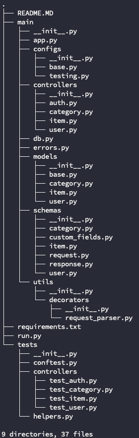

# Onboard Project Server side
## Description:
This is a Python Flask Application. It serves multiple endpoints allowing user to manipulate categorized items.

## Prerequisites:
- Python 3.7
- MySQL

## How to install:
You should create a virtual environment so that it will not affect other projects.
``` 
1. Create virtual env: 
virtualenv venv --python=python3
2. Install pip modules:
pip install -r requirements.txt
3. Fulfill ENVIRONMENT variables, we support loading from .env file placed in the server/ folder:
DATABASE_URL='SOME_URL'
APP_SECRET_KEY='SOME_KEY'
4. Install any MySQL connector like:
- PyMySQL
- MySQLdb
- mysql-connector-python
- Then remember to update the DATABASE_URL to tell which connector you are using:
'mysql+connector://...'
5. Since Flask-SQLAlchemy can't automatically create a new database, you should create it by yourself.
```
## How to run:
``` 
python run.py
```

## Project Overview:
### Endpoints:
You can see endpoints and its request/response example here:
[API documentation](https://documenter.getpostman.com/view/6660523/SVtVVoQ3?version=latest)

### Entity relationship:


### Project folder structure:


For each resource in modules folder, it usually contains:
- **init.py**: declare this resource folder is a package
- **model.py**: declare how this resource is represented in the database
- **controller.py**: declare routes and its function for each route (Blueprint)
- **schema.py**: declare Marshmallow schema for serialize and validate


